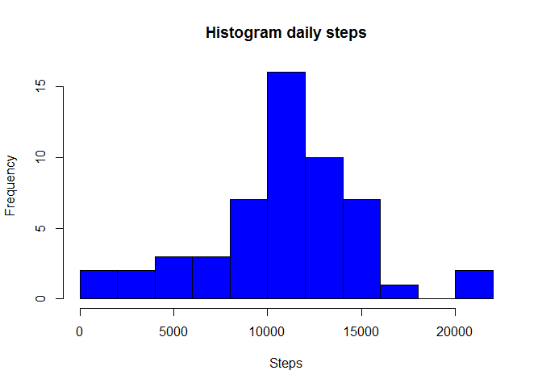
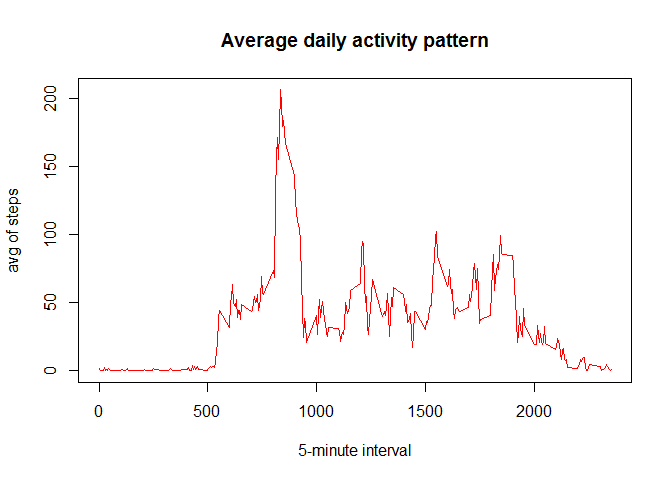
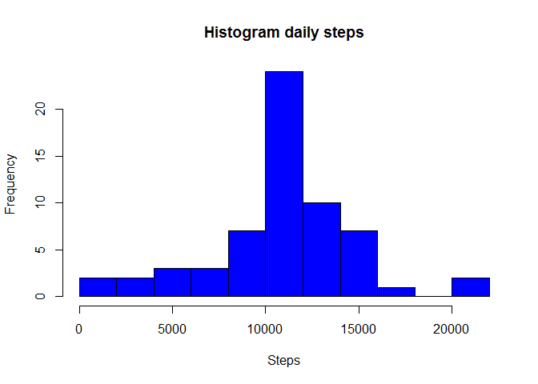
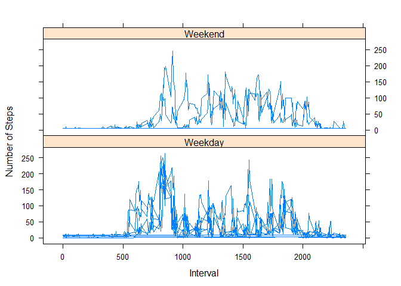

Loading and preprocessing the data
==================================

    activity_df <- read.csv("activity.csv", na.strings = "NA")
    summary(activity_df)

    ##      steps                date          interval     
    ##  Min.   :  0.00   2012-10-01:  288   Min.   :   0.0  
    ##  1st Qu.:  0.00   2012-10-02:  288   1st Qu.: 588.8  
    ##  Median :  0.00   2012-10-03:  288   Median :1177.5  
    ##  Mean   : 37.38   2012-10-04:  288   Mean   :1177.5  
    ##  3rd Qu.: 12.00   2012-10-05:  288   3rd Qu.:1766.2  
    ##  Max.   :806.00   2012-10-06:  288   Max.   :2355.0  
    ##  NA's   :2304     (Other)   :15840

1.  What is mean total number of steps taken per day?

<!-- -->

    total_steps <- aggregate(steps ~ date, activity_df, sum)
    mean(total_steps$steps, na.rm = TRUE)

    ## [1] 10766.19

1.  Make a histogram of the total number of steps taken each day

<!-- -->

    hist(as.numeric(total_steps$steps), breaks = 10, col = "blue", xlab = "Steps", main= "Histogram daily steps")

1.  Calculate and report the mean and median total number of steps taken
    per day

<!-- -->

    mean(activity_df$steps, na.rm = TRUE)

    ## [1] 37.3826

    median(activity_df$steps, na.rm=TRUE)

    ## [1] 0

What is the average daily activity pattern?
===========================================

1.  Make a time series plot (i.e. type = "l") of the 5-minute
    interval (x-axis) and the average number of steps taken, averaged
    across all days (y-axis)

<!-- -->

    time_series <- aggregate(steps ~ interval, activity_df, mean)
    plot(time_series, type="l", col="red", xlab ="5-minute interval",  ylab = "avg of steps", main = "Average daily activity pattern")

1.  Which 5-minute interval, on average across all the days in the
    dataset, contains the maximum number of steps?

<!-- -->

    max_interval <- time_series[which.max(time_series$steps),]
    max_interval$interval

    ## [1] 835

Imputing missing values
=======================

1.  Calculate and report the total number of missing values in the
    dataset (i.e. the total number of rows with NAs)

<!-- -->

    empty_values <- is.na(activity_df$steps)
    summary(empty_values)

    ##    Mode   FALSE    TRUE    NA's 
    ## logical   15264    2304       0

1.  Devise a strategy for filling in all of the missing values in
    the dataset. The strategy does not need to be sophisticated. For
    example, you could use the mean/median for that day, or the mean for
    that 5-minute interval, etc.

<!-- -->

    complete_activitydf <- activity_df

    for(i in 1:nrow(activity_df))
    {
      if(is.na(complete_activitydf[i, ]$steps))
      {
         complete_activitydf[i,]$steps <- mean(activity_df$steps, na.rm = TRUE)
      }
    }
    head(complete_activitydf)

    ##     steps       date interval
    ## 1 37.3826 2012-10-01        0
    ## 2 37.3826 2012-10-01        5
    ## 3 37.3826 2012-10-01       10
    ## 4 37.3826 2012-10-01       15
    ## 5 37.3826 2012-10-01       20
    ## 6 37.3826 2012-10-01       25

1.  Create a new dataset that is equal to the original dataset but with
    the missing data filled in.

*complete\_activity* is equal to the original without missing data

    head(is.na(complete_activitydf$steps)) 

    ## [1] FALSE FALSE FALSE FALSE FALSE FALSE

1.  Make a histogram of the total number of steps taken each day and
    Calculate and report the mean and median total number of steps taken
    per day. Do these values differ from the estimates from the first
    part of the assignment? What is the impact of imputing missing data
    on the estimates of the total daily number of steps?

<!-- -->

    total_steps <- aggregate(steps ~ date, complete_activitydf, sum)

    hist(as.numeric(total_steps$steps), breaks = 10, col = "blue", xlab = "Steps", main= "Histogram daily steps")

    mean(complete_activitydf$steps)

    ## [1] 37.3826

    median(complete_activitydf$steps)

    ## [1] 0

Are there differences in activity patterns between weekdays and weekends?
=========================================================================

1.  Create a new factor variable in the dataset with two levels --
    "weekday" and "weekend" indicating whether a given date is a weekday
    or weekend day.

<!-- -->

    complete_activitydf$weekday <- weekdays(as.Date(complete_activitydf$date))

1.  Make a panel plot containing a time series plot (i.e. type = "l") of
    the 5-minute interval (x-axis) and the average number of steps
    taken, averaged across all weekday days or weekend days (y-axis).
    The plot should look something like the following, which was created
    using simulated data:

<!-- -->

    steps_per_day <- aggregate(steps ~ interval+weekday, complete_activitydf, mean)
    head(steps_per_day)

    ##   interval weekday    steps
    ## 1        0  Friday 8.307244
    ## 2        5  Friday 8.307244
    ## 3       10  Friday 8.307244
    ## 4       15  Friday 8.307244
    ## 5       20  Friday 8.307244
    ## 6       25  Friday 8.307244

    for(i in 1:nrow(steps_per_day))
    {
      if(steps_per_day[i, ]$weekday == "Saturday" || steps_per_day [i, ]$weekday == "Sunday")
      {
        steps_per_day[i, ]$weekday <- "Weekend"
      }
      else
      {
        steps_per_day[i, ]$weekday <- "Weekday"
      }
    }

    ## Warning: package 'lattice' was built under R version 3.3.3

